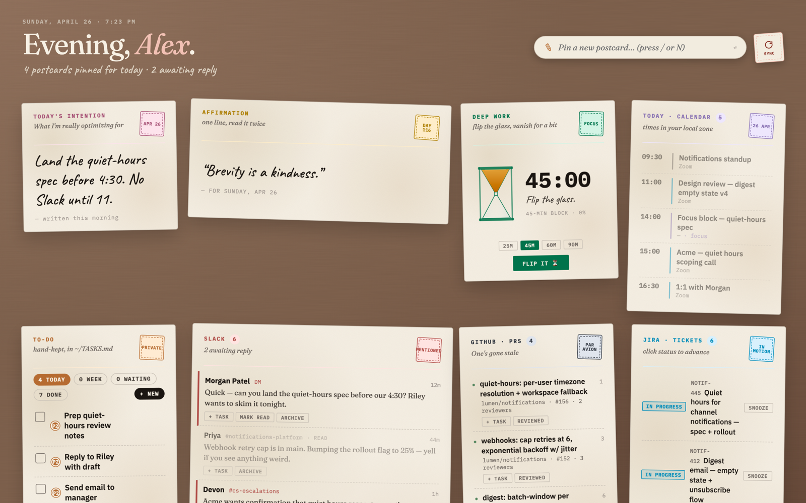

# The Postcard Desk



A personal dashboard styled as a warm-wood desk covered in postcards — one per source: Slack, GitHub, Jira, Google Calendar, Google Drive, Confluence, plus a daily intention, a to‑do card, an affirmation, and a focus timer.

**Live demo:** [postcard-desk.vercel.app](https://postcard-desk.vercel.app) (read-only, bundled with seed data)

It's **local-first**. There's no backend, no OAuth flow, no API keys in this app. The data lives in JSON files on disk. The **refresh mechanism** is a Claude Code agent that pulls from your MCPs (Slack, GitHub, Google, Atlassian…) and overwrites the JSON files when you ask it to.

That's the whole idea: **Claude is the backend**. The React app is just a pretty viewer for files that a scheduled Claude run keeps fresh.

---

## Why build it this way

Most "AI dashboards" try to be live — always-on webhooks, always-connected OAuth clients, always stale because the webhook you forgot to fix a month ago is silently broken. This flips the model:

- The dashboard is a **snapshot**.
- A cron job says *"refresh the desk"* to a headless Claude Code agent every minute during work hours.
- Claude calls your MCPs in parallel, writes `data/*.json`, exits.
- The React app polls the files and re-renders.

Cheap, simple, honest. The staleness is visible (the footer literally says *"Synced 10:06 PM"*). When a source drops, you notice — and you fix the prompt instead of spelunking through someone else's webhook code.

---

## Run it in 60 seconds

```bash
git clone https://github.com/YOUR-FORK/postcard-desk.git
cd postcard-desk
npm install
npm run dev
# opens http://localhost:5180
```

First boot reads from `data/seed/` (fictional demo data for a made-up PM named Alex). That lets you see the UI work without any setup.

---

## Make it yours

### 1. Replace the demo data with your own

Anything you drop into `data/` overrides the corresponding seed file. The shapes:

| File | Shape | What it drives |
|---|---|---|
| `data/intention.json` | `{ text: string }` | Daily intention card |
| `data/slack.json` | `{ id, who, channel, msg, ago, urgent }[]` | Slack postcard |
| `data/prs.json` | `{ id, num, repo, title, age, stale, reviewers }[]` | GitHub postcard |
| `data/jira.json` | `{ id, key, title, status }[]` | Jira postcard (status ∈ To Do / In Progress / Review / Blocked / Done) |
| `data/confluence.json` | `{ id, space, title, by, ago, kind }[]` | Confluence postcard (kind ∈ edited / shared / mentioned) |
| `data/calendar.json` | `{ id, time, end, title, loc, kind }[]` | Calendar postcard (kind ∈ recurring / focus / meeting) |
| `data/gdocs.json` | `{ id, title, kind, by, ago, url }[]` | Google Drive postcard |
| `data/last_synced.json` | `{ iso, label, sources }` | "Synced 10:06 PM" in the footer |

### 2. Wire up the To-Do card

Tasks are read/written **live** against `~/TASKS.md`. That file uses a trivial markdown convention:

```markdown
# TASKS

## Today
- [ ] [P1] Ship the quiet-hours spec
  *_anchor doc: "PRD — Quiet Hours"_

## This Week
- [ ] [P2] Review Q3 roadmap

## Waiting On
- [ ] [P2] Morgan — review spec by Friday

## Done
- [x] [P2] Send weekly update ~2026-04-21
```

Priority is `[P1]` / `[P2]` / `[P3]`. Indented italic lines become task notes. No other setup — the Vite dev plugin reads this file on every `GET /api/state`.

### 3. Teach Claude to refresh the postcards

This is the fun part. You need [Claude Code](https://claude.com/claude-code) with MCPs connected to your actual services. Common ones:

- **Slack MCP** — for mentions, DMs, channel activity
- **GitHub MCP** — for your open PRs
- **Google Calendar MCP** — for today's meetings
- **Google Drive MCP** — for recent docs
- **Atlassian MCP** — for Jira + Confluence

Once connected, ad-hoc refresh is a one-liner — say *"refresh the postcard desk"* to Claude and it writes the JSON files. But the real payoff is **letting cron do it for you**:

```bash
cp scripts/refresh.sh scripts/refresh.local.sh
# edit GH_USER, SLACK_HANDLE, DESK_DIR at the top

crontab -e
# runs every minute, self-gates to weekdays 9am–9pm local
* * * * * /ABSOLUTE/PATH/TO/postcard-desk/scripts/refresh.local.sh
```

That's it. The script invokes headless Claude Code with the refresh prompt, gated by work hours so it sleeps on evenings and weekends. The postcards stay within ~60 seconds of reality while you do real work.

`refresh.local.sh` is in `.gitignore` so your real handles never land in the repo.

---

## Architecture

```
┌─────────────────────┐        ┌─────────────────────────────┐
│  Your MCPs          │        │   React app (Vite dev)      │
│  (Slack, GitHub,    │        │   localhost:5180            │
│   Google, Atlassian)│        │                             │
└──────────┬──────────┘        │   GET /api/state  ──┐       │
           │                   │                     │       │
           │ Claude Code       │   PUT /api/tasks   ─┤       │
           │ (headless or      │   PUT /api/intention┤       │
           │  interactive)     │   PUT /api/source/* ┤       │
           ▼                   └─────────────────────┼───────┘
┌─────────────────────┐                              │
│  data/*.json        │ ◀────────────────────────────┘
│  ~/TASKS.md         │      (vite-plugins/local-api.ts)
└─────────────────────┘
```

- **`vite-plugins/local-api.ts`** — a Vite dev-server middleware that serves `/api/state` by reading `data/*.json` (falling back to `data/seed/*.json`) + `~/TASKS.md`. Accepts `PUT`s for tasks, intention, and any individual source.
- **`src/state.ts`** — the `useDesk()` hook. Single fetch, optimistic updates, debounced writes.
- **`src/components/cards/`** — ten dumb postcard components. Each is just CSS + a map over its array.
- **`src/tokens.css`** — the whole look: OKLCH colors, SVG paper-noise textures, hand-drawn keyframe animations (hourglass sway/wobble/spark/stream for the focus timer, tape-stuck postcards).
- **`scripts/refresh.sh`** — the reference "ask Claude to refresh" prompt, cron-wrapped with work-hours gating.

---

## What's *not* here (on purpose)

- **No database.** JSON on disk is enough for a personal tool. Backup = `cp -r`.
- **No auth / no accounts.** This is local-only. Don't expose `npm run dev` to the internet.
- **No live webhooks.** Cron pokes Claude on a schedule; staleness is a feature, not a bug.
- **No framework.** Plain React + Vite. Zero state libraries beyond `useState`/`useReducer`.

---

## Tech

Vite 7 · React 19 · TypeScript 5.9 · no other runtime deps

---

## License

MIT — see [LICENSE](./LICENSE). Make it yours, change the aesthetic, swap the sources. If you build something interesting on top, I'd love to see it.
